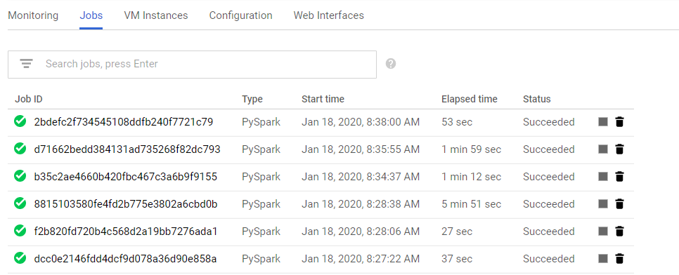
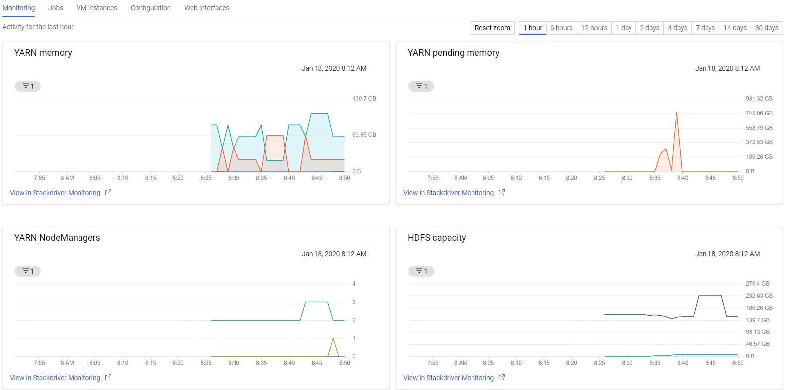
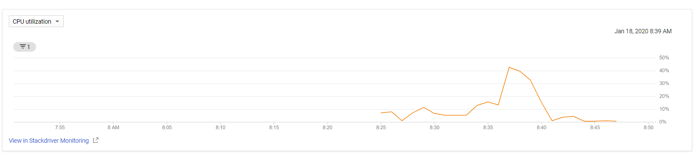

# Implementation

Dataproc was chosen as a solution of architecture, since it is a cloud service which already implements Spark, Hadoop and a full set of operations to parameterize and scale up/down the cluster. Moreover, it's pretty easy to set, add components and run provision scripts.

## Requirements

* Google Cloud Account
* Bucket with the initialization scripts

## Launching Cluster

* Ensure the initialization script is on Cloud Storage.

Currently, dataproc supports only gs:// paths for initialization scripts.
Upload to CloudStorage and add its path to variable INIT_ACTION

Nice to have: Add cloudbuild.yaml to automatically rsync the init action on cloud storage

* Export GCP Project, AWS Credentials, SOURCE_REPO AND INIT_ACTION
```
export PROJECT_ID=<project_id>
export AWS_ACCESS_KEY_ID=<key_id>
export AWS_SECRET_ACCESS_KEY=<key_secret>
export SOURCE_REPO=https://github.com/lordravo/ifood-data-architect-test.git
export INIT_ACTION=<init_action_gs_path>
```

* Execute and wait for cluster creation:
```
bash launch_cluster.sh
```

* Autoscaling

Use launch_autoscale_cluster.sh instead. Be sure to export MAX_WORKERS first

* Superset

A BI dashboard web application. To launch superset, read [superset/README.md](./superset)

## Submiting Job

Run submit_job.sh script passing the job_name. Example
```
bash submit_job.sh create_table_raw_consumer
```

## Performance
Performance can be tracked either by the cluster monitor board (and stackdriver), or through the Hadoop and Spark respective interfaces.








## Scalability
Scalability can be achieved focusing on highmem workers (as seen on the autoscale script), and migrating data to a external storage, such as S3 or GCS.

## Alternative Contexts and Solutions

1. Complex job dependencies:

Adopt a workflow framework such as Airflow for DAGs, or Jenkins for Pipelines

2. Real-time streaming data:

Ingestion through Apache Beam (KafkaIO/PubsubIO)

## Reference

* Dataproc: https://cloud.google.com/dataproc
* Dataproc SubmitJob: https://cloud.google.com/dataproc/docs/guides/submit-job
* Hadoop Python: https://thegurus.tech/posts/2019/05/hadoop-python/
* Pyspark SQL: https://s3.amazonaws.com/assets.datacamp.com/blog_assets/PySpark_SQL_Cheat_Sheet_Python.pdf
* SQL Language: https://cwiki.apache.org/confluence/display/Hive/LanguageManual+Select , 
  https://docs.databricks.com/spark/latest/spark-sql/index.html#sql-language-manual ,
  http://spark.apache.org/docs/2.3.0/api/sql/index.html
