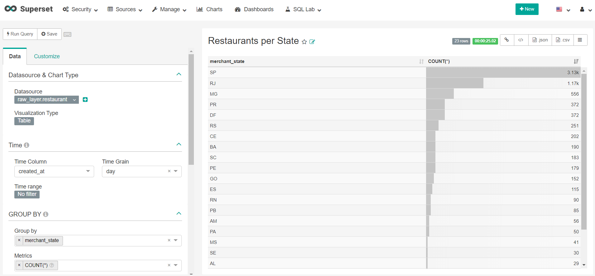

# Superset

Quick superset launch at Dataproc Cluster, for fast analysis and dashboard development on raw and trusted layer

## Launching Superset

Launching the cluster with superset (launch_cluster_superset.sh) requires new control variables:
```
export SUPERSET_MAIL=<superset_mail>
export SUPERSET_USER=<superset_user>
export SUPERSET_PASS=<superset_pass>
export SUPERSET_FNAME=<superset_fname>
export SUPERSET_LNAME=<superset_lname>
export SUPERSET_PORT=<superset_port>
export SUPERSET_INIT=<superset_init_action_gs_path>
export SUPERSET_CONFIG=<superset_config_gs_path>
```

## Databases

After job executions, add the following databases:
* hive://localhost:10000/raw_layer
* hive://localhost:10000/trusted_layer

## Example



## Reference

* Superset: https://github.com/apache/incubator-superset
* Hive Issue: https://github.com/apache/incubator-superset/issues/7270
* Hive Date Functions: https://cwiki.apache.org/confluence/display/Hive/LanguageManual+UDF#LanguageManualUDF-DateFunctions
